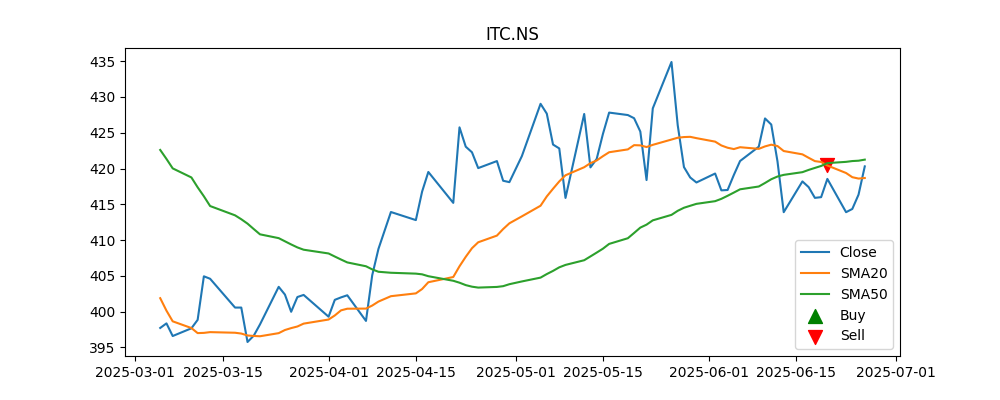
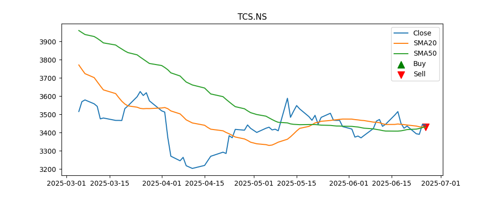
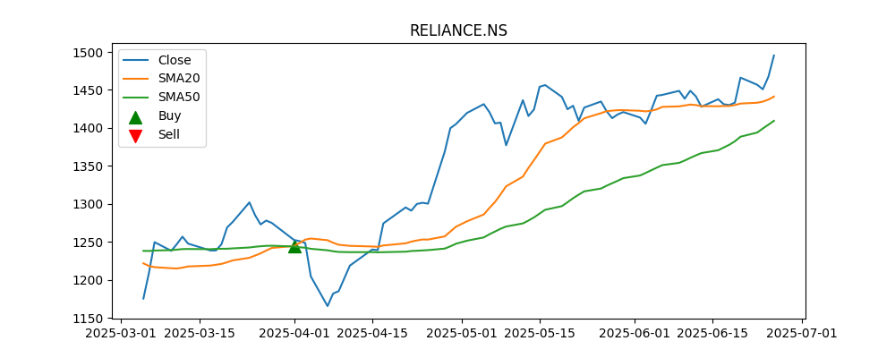

# Algo_Trading

[Watch the demo on YouTube](https://youtu.be/9dhIE1xp8IU)

## Setup to Run the Program

1. **Clone the repo**  
   ```bash
   git clone https://github.com/Rangan2005/Algo_Trading.git
   ```

2. **Install required dependencies**  
   ```bash
   pip install -r requirements.txt
   ```

3. **Get your `credentials.json` for Google Sheets & Drive API access**

   a. Go to the [Google Cloud Console](https://console.cloud.google.com/)  
   b. Create a new project or select an existing one  
   c. Navigate to **API & Services → Library**  
   d. Enable both **Google Sheets API** and **Google Drive API**  
   e. Go to **API & Services → Credentials**  
   f. Click **Create Credentials → Service Account**, name it, and skip through  
   g. Once created, go back to the **Credentials** page and click your service account  
   h. Go to the **Keys** tab → **Add Key → Create new key → JSON**  
   i. A JSON file will be downloaded. Rename it to `credentials.json` and move it to your project folder  

4. **Run the project**  
   ```bash
   python main.py
   ```

## Results

**With RSI**

No buy signal hence no trades generated for the 3 stocks as no such day exists when both RSI<30 and DMA20 crosses over DMA50




**Without RSI**

Buy Signal when DMA20 crosses over DMA50, Sell Signal when DMA50 crosses over DMA20



**ML Model Results**

Decision Tree Classifier was used

Accuracy for RELIANCE.NS: 46.67%
Accuracy for ITC.NS: 66.67%
Accuracy for TCS.NS: 0.4667
